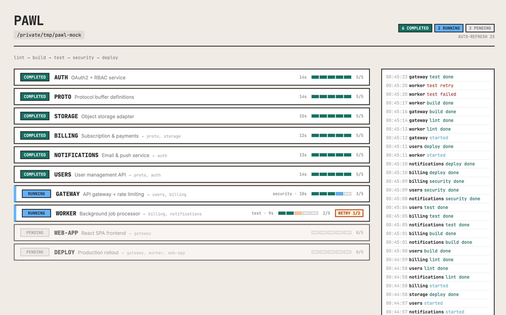

# Pawl

Shell can pipe, chain, trap, and cron — but it can't **pause, wait for a decision, resume after a crash, or route failures**. pawl adds these missing primitives: a single binary that turns any shell pipeline into a resumable coroutine with failure routing.

```
  pawl start task-a     build ── test ─╳ (fail)
                                       └─ retry ── test ─── deploy ── gate ── verify
                                                                        ↑
  Close laptop. Fly across the world.                            pawl done task-a
  Reboot. pawl start task-a. Continues from gate.
```

One invariant: `state = replay(log)`. Append-only JSONL, no database, no status file.



## Install

```bash
cargo install pawl
```

Requires: Rust. Optional: tmux (only for interactive `in_viewport` steps).

## Quick Start

```bash
pawl init                    # scaffold .pawl/ with config + full reference
# edit .pawl/config.json     # define your workflow
pawl start my-task           # run the pipeline
pawl dashboard               # live web dashboard on localhost:3131
```

## How It Works

Define a workflow in `.pawl/config.json`:

```json
{
  "workflow": [
    { "name": "build",   "run": "npm run build" },
    { "name": "test",    "run": "npm test", "on_fail": "retry" },
    { "name": "deploy",  "run": "npm run deploy" },
    { "name": "verify",  "verify": "manual" }
  ]
}
```

Four primitives compose into any workflow:

| Primitive | Config | What happens |
|-----------|--------|-------------|
| **Run** | `"run": "..."` | Execute. Non-zero exit = failure. |
| **Gate** | no `run` | Pause until `pawl done`. |
| **Retry** | `"on_fail": "retry"` | Auto-retry on failure (default: 3x). |
| **Yield** | `"verify": "manual"` or `"on_fail": "manual"` | Pause for judgment. |

Add `"in_viewport": true` to run in an interactive terminal (tmux).

### Variables & Hooks

Commands support `${var}` expansion. 9 built-in variables (`task`, `step`, `run_id`, `retry_count`, `last_verify_output`, ...) plus user-defined `vars`:

```json
{
  "vars": {
    "branch": "pawl/${task}",
    "worktree": "${project_root}/.pawl/wt/${task}"
  },
  "on": {
    "step_finished": "echo '${task}/${step} exit=${exit_code}' >> .pawl/hooks.log"
  }
}
```

`vars` are expanded in declaration order (later vars can reference earlier ones). All available as `PAWL_*` env vars.

`on` maps event types to shell commands (fire-and-forget). 10 event types: `task_started`, `step_finished`, `step_yielded`, `step_resumed`, `step_skipped`, `step_reset`, `viewport_launched`, `viewport_lost`, `task_stopped`, `task_reset`.

### Multi-Task with Dependencies

All tasks share one workflow. Tasks can declare dependencies (DAG) and skip steps they don't need:

```json
{
  "tasks": {
    "lib":  { "description": "Core library" },
    "api":  { "depends": ["lib"] },
    "web":  { "depends": ["lib"], "skip": ["deploy"] },
    "ship": { "depends": ["api", "web"], "skip": ["build", "test"] }
  },
  "workflow": [
    { "name": "build", "run": "make build -C ${task}" },
    { "name": "test",  "run": "make test -C ${task}", "on_fail": "retry" },
    { "name": "deploy","run": "make deploy -C ${task}" }
  ]
}
```

```bash
pawl start lib & pawl start api & pawl start web & pawl start ship
# lib runs immediately; api + web wait for lib; ship waits for both
# web skips deploy; ship skips build+test (only deploys)
```

`skip` turns one workflow into many — each task derives its own step sequence by exclusion.

## CLI

```bash
pawl start <name> [--reset]       # run pipeline (--reset: reset first, then start)
pawl status [name]                # query status with routing hints
pawl list                         # all tasks summary
pawl done <name> [-m msg]         # approve waiting step / complete viewport step
pawl stop <name>                  # stop a running task
pawl reset <name> [--step]        # full reset or retry current step
pawl wait <n...> --until <s> [--any] [-t sec]  # block until target status
pawl events [name] [--follow] [--type ...]     # event stream
pawl log <name> [--step N] [--all]             # view log events
pawl dashboard [--port N]         # live web dashboard (default: 3131)
```

Exit codes: 0=success, 2=state conflict, 3=precondition (deps), 4=not found, 5=already exists, 6=validation, 7=timeout.

## Self-Routing

stdout = JSON, stderr = progress. `pawl status` returns machine-readable routing hints — consumers don't need to understand pawl:

```bash
pawl status task-a | jq '{suggest, prompt}'
# suggest: ["pawl reset --step task-a"]     ← execute directly
# prompt:  ["verify test results, then: pawl done task-a"]  ← requires judgment
```

Orchestrate multiple tasks:

```bash
pawl wait task-a task-b --until completed --any   # return when ANY finishes
pawl wait task-a task-b --until completed          # return when ALL finish
```

## Design

Three ideas, everything else follows:

1. **`state = replay(log)`** — Append-only JSONL is the single source of truth. Crash, reboot, replay, resume.
2. **Separate what from where** — Recording (what happened) and routing (what to do next) never mix.
3. **Trust the substrate** — File system, exit codes, tmux. Build only what Unix can't.

## Tests

204 tests: 136 sync E2E, 27 viewport E2E, 9 real-agent E2E, 32 unit tests.

```bash
cargo test                    # unit tests
bash tests/e2e.sh             # sync workflows
bash tests/e2e-viewport.sh    # viewport lifecycle (requires tmux)
bash tests/e2e-agent.sh       # real AI agents (requires API key, ~$0.05)
```

## Documentation

`pawl init` generates `.pawl/README.md` — the full reference for config schema, commands, variables, and event hooks.

## Ecosystem

- [pawl-foreman](https://github.com/yansircc/agent-skills) — Claude Code skill for orchestrating AI agents with pawl

  ```bash
  /plugin marketplace add yansircc/agent-skills
  /plugin install pawl-foreman@yansircc-skills
  ```

## License

MIT
